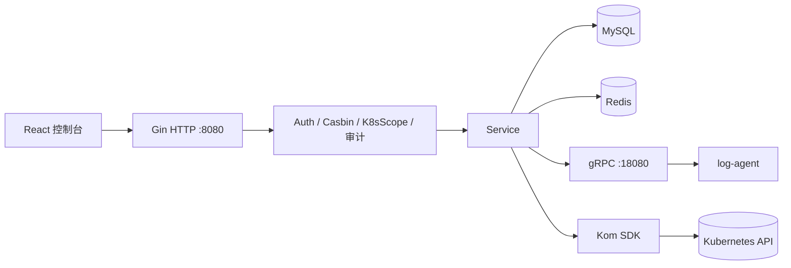
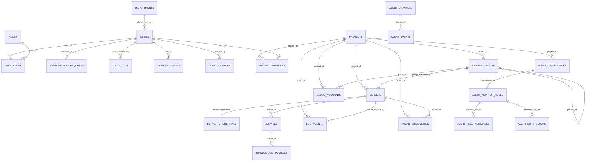

# Yunshu

[](https://go.dev/)
[](https://react.dev/)
[](https://ant.design/)
[](#)

> 基于 Go + React 的 Kubernetes 运维与项目化告警平台，涵盖系统管理、权限管理、项目管理、K8s 资源管理、告警平台与日志平台。

---

## 目录

- [项目简介](#项目简介)
- [架构与权限模型](#架构与权限模型)
- [快速开始](#快速开始)
  - [环境要求](#环境要求)
  - [本地源码启动](#本地源码启动)
  - [Docker Compose 部署](#docker-compose-部署)
  - [分支切换（git checkout）](#分支切换git-checkout)
- [配置说明](#配置说明)
- [运维操作手册](#运维操作手册)
  - [首次登录与初始化](#首次登录与初始化)
  - [权限配置（Casbin + 集群档位）](#权限配置casbin--集群档位)
  - [纳管 Kubernetes 集群](#纳管-kubernetes-集群)
  - [日志平台与 Agent](#日志平台与-agent)
  - [告警平台要点](#告警平台要点)
- [前端路由索引](#前端路由索引)
- [常用 CLI 命令](#常用-cli-命令)
- [排障指南](#排障指南)
- [功能状态标记说明](#功能状态标记说明)
- [页面功能与截图](#页面功能与截图)
  - [1. 登录与概览](#1-登录与概览)
  - [2. 系统管理](#2-系统管理)
  - [3. 项目管理](#3-项目管理)
  - [4. 告警平台](#4-告警平台)
  - [5. Kubernetes 管理](#5-kubernetes-管理)
- [告警通知与恢复示例](#告警通知与恢复示例)
- [数据库 ER 图](#数据库-er-图)
- [项目结构](#项目结构)
- [文档链接](#文档链接)
- [参考项目](#参考项目)

---

## 项目简介

Yunshu 主要能力：

- 多模块后台管理（用户、角色、菜单、组织、字典、审计）
- **双层 K8s 鉴权**：Casbin API 权限 + 集群档位（`readonly` / `readonly_exec` / `admin`）+ 命名空间黑/白名单
- 项目维度的服务器、服务、日志源、Agent、**SSE 实时日志**与 Agent 发现
- 告警数据源、规则、值班、静默、策略、多渠道通知（钉钉/邮件等）
- Kubernetes 资源可视化管理（工作负载、网络、存储、RBAC、CRD、Ingress-Nginx 运维）

默认管理员（`go run . seed` 后）：

| 项 | 值 |
|----|-----|
| 用户名 | `admin` |
| 密码 | `Admin@123` |
| 邮箱 | `admin@example.com` |

---

## 架构与权限模型

### 分层架构



### 三道权限闸门（K8s 相关请求）

| 顺序 | 控制台入口 | 作用 |
|------|------------|------|
| 1 | **授权管理**（角色勾选 API） | 能否调用该 HTTP 接口（Casbin） |
| 2 | **API 管理 → K8s 范围校验** | 该路由是否进入集群档位中间件 |
| 3 | **K8s 集群访问档位** + **命名空间黑/白名单** | 在指定 `cluster_id` / `namespace` 上是否具备足够档位 |

档位说明：

| 档位 | 典型能力 |
|------|----------|
| `readonly` | 列表/详情类 GET（资源只读 API） |
| `readonly_exec` | 只读 + Pod 日志/终端 Exec |
| `admin` | 变更类操作（apply/delete/scale、Ingress-Nginx 重启等） |

详细设计见：[docs/handbook/permissions/casbin-and-k8s-triple-policy.md](docs/handbook/permissions/casbin-and-k8s-triple-policy.md)

---

## 快速开始

### 环境要求

- Go 1.23+
- Node.js 18+
- MySQL
- Redis

### 本地源码启动

#### 启动步骤

```bash
git clone <your-repo-url>
cd yunshu
git checkout <branch-name>
go mod download
cd web && npm install && cd ..

go run . migrate
go run . seed
go run . server
```

新终端启动前端：

```bash
cd web
npm run dev
```

访问地址（本地开发）：

| 服务 | 地址 |
|------|------|
| 前端 | http://localhost:5173 |
| 后端 API | http://localhost:8080 |
| Swagger | http://localhost:8080/swagger/index.html |
| gRPC（Agent） | localhost:18080 |

> 后端二进制入口为 Cobra 子命令，根命令名为 `permission-system`（`go run . server` 即可）。

### Docker Compose 部署

项目根目录已提供 `docker-compose.yml`，包含以下服务：

- `mysql`（5.7）
- `redis`（7.x）
- `backend`（Go API）
- `frontend`（Nginx + 前端静态资源）

#### 1) 启动

```bash
git clone <your-repo-url>
cd yunshu
git checkout <branch-name>
# 首次或镜像更新时建议带 --build
docker compose up -d --build
```

#### 2) 查看状态与日志

```bash
docker compose ps
docker compose logs -f backend
docker compose logs -f frontend
```

#### 3) 停止与清理

```bash
docker compose down

# 连同数据卷一起清理（谨慎）
docker compose down -v
```

#### 4) 访问入口

- 前端：`http://<host>:80`
- 后端 API：`http://<host>:8080`

> 说明：`docker-compose.yml` 默认读取项目内 `configs`、`logs`，并映射 MySQL/Redis 端口。生产环境请替换默认密码、JWT/加密密钥，并按需调整挂载路径与资源限制。

### 分支切换（git checkout）

```bash
# 查看本地与远程分支
git branch -a

# 切换到已有本地分支
git checkout <branch-name>

# 基于远程分支创建并切换本地分支
git checkout -b <branch-name> origin/<branch-name>

# 回到主分支（按仓库实际分支名 main/master）
git checkout main
```

常见场景建议：

- 开发新功能：从 `main` 切新分支后再开发。
- 联调/排障：先 `git checkout main && git pull`，再切目标分支，避免基线过旧。

---

## 配置说明

主配置文件：`configs/config.yaml`（可通过 `--config` 指定路径）。

| 配置块 | 说明 |
|--------|------|
| `app` / `http` | 服务端口、超时；**日志 SSE 长连接**建议 `read_timeout_seconds` / `write_timeout_seconds` 为 `0` |
| `mysql` / `redis` | 业务库与缓存 |
| `grpc` | 平台 gRPC（Agent Ingest、runtime-config）；默认 `18080` |
| `auth` | JWT 密钥、Token 有效期、邮箱验证码 TTL |
| `agent` | `register_secret`（Agent 自注册）、`discovery_roots`（引导扫描目录） |
| `security.encryption_key` | 服务器 SSH 等敏感字段加密 |
| `alert` | Webhook、Prometheus 富化、聚合窗口等（部分项可在**数据字典**覆盖） |

生产环境务必修改：MySQL/Redis 密码、`auth.jwt_secret`、`security.encryption_key`、`agent.register_secret`。

---

## 运维操作手册

### 首次登录与初始化

1. 执行 `go run . migrate` 与 `go run . seed`（Docker 镜像内通常在启动脚本中已包含，以实际 Dockerfile 为准）。
2. 使用 `admin` / `Admin@123` 登录控制台。
3. **系统管理 → 菜单管理**：确认菜单树完整；若缺失可再次执行 `seed`。
4. **系统管理 → 授权管理**：为业务角色勾选所需 API（或复制 `super-admin` 策略模板）。

### 权限配置（Casbin + 集群档位）

**场景：让角色 `dev` 只读访问集群 1 的 `default` 命名空间**

1. **API 管理**：确认 Pod/Deployment 等列表接口已勾选「K8s 范围校验」。
2. **授权管理**：为角色 `dev` 勾选对应 GET 接口（如 `/api/v1/pods` GET）。
3. **K8s 集群访问档位**（菜单路径以 seed 为准，一般为「K8s 范围策略」或「集群档位」）：
   - 主体：角色 `dev`
   - 集群：`1`
   - 档位：`readonly`
4. （可选）**命名空间白名单**：仅允许 `default`。
5. 使用 `dev` 用户登录验证：列表可读；`apply` / `delete` / `exec` 应返回 403。

**高危操作额外要求**

| 操作 | 要求 |
|------|------|
| Pod Exec（HTTP/WS） | `readonly_exec` 及以上 + Casbin 授权 |
| Ingress-Nginx 重启 `POST /api/v1/ingresses/nginx/restart` | **admin 档位** + 请求体 `confirm: true` + Casbin 授权 |
| Node 调度/污点 | 已纳入 K8s 范围校验，需 **admin** 档位 |

### 纳管 Kubernetes 集群

1. **集群管理 → 新建集群**
   - 连接方式：`kubeconfig`（粘贴 YAML）或 `direct`（API Server + Token/证书）。
   - 可选 **归属项目**：非 super-admin 仅能看到有项目成员关系的集群。
2. 保存后查看 **连接状态**；失败时检查 kubeconfig、网络与 API Server 可达性。
3. **安全说明**：详情接口**不回显**完整 kubeconfig/密钥，仅显示 `kubeconfig_configured` 与脱敏后的直连字段；更新凭证需重新粘贴。
4. **组件状态 / 命名空间**：在集群详情或对应菜单查看。

### 日志平台与 Agent

#### 1. 平台侧准备

1. 在 **项目管理** 中创建项目，添加 **服务器**、**服务**、**日志源**（file 类型 path 支持 glob，如 `/var/log/pods/*/*.log`）。
2. **Agent 列表**：注册 Agent 或使用 Bootstrap 命令（见集群/服务器页说明）。
3. `configs/config.yaml` 中配置 `agent.register_secret` 与可选 `agent.discovery_roots`（如 `/var/log`）。

#### 2. 部署 log-agent（目标机器）

```bash
# 编译
go build -o log-agent ./cmd/logagent

# 常用参数（需先在平台拿到 server_id、token）
./log-agent \
  --grpc-server=<平台IP>:18080 \
  --server-id=<服务器ID> \
  --token=<Agent Token> \
  --enable-runtime-pull=true \
  --enable-discovery=true \
  --discovery-interval=30m \
  --discovery-roots=/var/log,/var/log/pods
```

或使用主程序子命令：

```bash
go run . log-agent --grpc-server=127.0.0.1:18080 --server-id=1 --token=<token>
```

诊断连通性与 Token：

```bash
go run . log-agent-doctor --grpc-server=127.0.0.1:18080 --server-id=1 --token=<token>
```

#### 3. 控制台查看日志

1. 打开 **项目 → 日志平台**。
2. 选择项目、服务器、服务、日志源；可选具体日志文件（来自 Agent **发现**）。
3. 点击 **开始**：SSE 拉流；URL 会同步 `project_id` / `server_id` / `log_source_id`，支持刷新后 `autostart=1` 恢复。
4. 离开页面后底部 **日志流 Dock** 可后台继续；返回日志页可暂停/停止。
5. **发现未配置日志源**：面板展示 Agent 上报且未匹配现有源的路径，可 **一键创建日志源**。

API 细节见：[docs/log-platform-api.md](docs/log-platform-api.md)

### 告警平台要点

1. **告警数据源**：绑定项目与 Prometheus（等）地址。
2. **告警规则 / 值班**：规则归属由数据源推导；配置值班块与通知对象。
3. **告警策略**：匹配标签、路由到渠道（钉钉/邮件/Webhook）。
4. **告警静默**：维护窗口内抑制通知。
5. **Alertmanager Webhook**：配置 `alert.webhook_token`（或数据字典），指向 `POST /api/v1/alerts/webhook`。

说明见：[docs/alert-notify-guide.md](docs/alert-notify-guide.md)、[docs/alert-routing-and-delivery-guide.md](docs/alert-routing-and-delivery-guide.md)

---

## 前端路由索引

| 模块 | 路径示例 |
|------|----------|
| 总览 | `/` |
| 用户/角色/授权/API/菜单 | `/users`、`/roles`、`/policies`、`/permissions`、`/menus` |
| K8s 档位/NS 策略 | `/k8s-scoped-policies` |
| 项目与日志 | `/projects`、`/project-logs`、`/project-log-sources` |
| 集群与资源 | `/clusters`、`/pods`、`/deployments`、… |
| 告警 | `/alert-config-center`、`/alert-events` 等 |

完整菜单由 `seed` 写入 `menus` 表，前端按权限动态加载。

---

## 常用 CLI 命令

```bash
# 数据库迁移与种子数据
go run . migrate
go run . seed

# 启动 HTTP + gRPC 服务
go run . server

# 日志 Agent（见上文）
go run . log-agent --help
go run . log-agent-doctor --help

# 测试与格式化
go test ./...
gofmt -w ./...

# 前端
cd web && npm run dev      # 开发
cd web && npm run build    # 生产静态资源
```

OpenAPI / Swagger：启动后访问 `/swagger/index.html`。部分接口说明见 `docs/apipost/`。

---

## 排障指南

| 现象 | 排查建议 |
|------|----------|
| 登录后菜单为空 | 执行 `seed`；检查角色是否分配；检查菜单 `status` |
| K8s 操作 403 | 依次检查：授权管理 API → 集群档位 → NS 黑/白名单；请求是否带 `cluster_id` |
| Pod Exec 403 | 需 `readonly_exec`；WS 需 Casbin + 档位；检查 Origin 与 token |
| 日志 SSE 中断 | 网关/反向代理禁用缓冲；后端 `write_timeout_seconds=0`；见 `config.yaml` 注释 |
| Agent 不上报 | `log-agent-doctor`；gRPC 18080 是否可达；`register_secret` / token |
| 发现列表为空 | Agent 需 `--enable-discovery`；先配置至少一条日志源或 `discovery_roots`；等待扫描/重启 Agent |
| 集群详情无 kubeconfig | 预期行为（安全脱敏）；更新时重新粘贴 YAML |
| 首页 Pod 统计与预期不符 | 非 super-admin 仅聚合**有项目成员关系且具备 readonly+ 档位**的集群 |
| Docker 后端连不上库 | 检查 `MYSQL_*` / `REDIS_*` 环境变量与服务名 `yunshu-mysql` |

---

## 功能状态标记说明

-  已实现：`- [x]`
-  未实现/待规划：`- [ ]`

---

## 页面功能与截图

> 按你 `images` 目录中的页面分组整理，每个页面给出“已实现/待规划”能力点。

### 1. 登录与概览

#### 系统登录页面-账密登录


- [x] 用户名/密码登录
- [x] 登录失败提示与鉴权校验
- [ ] 第三方统一登录（如 OAuth2 / SSO）

#### 系统登录页面-邮箱登录


- [x] 邮箱验证码登录流程
- [x] 登录后权限菜单动态加载
- [ ] 多因子验证（MFA）统一入口

#### 概览页面


- [x] 系统总览数据展示
- [x] 关键指标可视化
- [x] Pod/事件按**项目成员 + 集群档位**过滤聚合（非 super-admin）
- [ ] 指标自定义看板

---

### 2. 系统管理

#### 系统管理-用户管理页面


- [x] 用户增删改查
- [x] 用户状态管理
- [ ] 批量导入审批流

#### 用户管理-用户设置页面


- [x] 个人信息维护
- [x] 账号基础设置
- [ ] 个性化主题/通知偏好

#### 系统管理-角色管理页面


- [x] 角色增删改查
- [x] 角色与用户绑定
- [ ] 角色模板快速复制

#### 系统管理-授权管理页面


- [x] Casbin 权限规则维护
- [x] API 级授权分配
- [ ] 可视化权限冲突分析

#### 系统管理-菜单管理页面


- [x] 菜单树管理
- [x] 菜单顺序与父子层级维护
- [ ] 菜单版本回滚

#### 系统管理-组织架构管理页面


- [x] 部门树管理
- [x] 组织层级调整
- [ ] 组织历史变更审计报表

#### 系统管理-数据字典管理页面


- [x] 字典项增删改查
- [x] 字典在业务表单中复用
- [ ] 字典国际化多语言

#### 系统管理-登录日志页面


- [x] 登录记录查询
- [x] 关键字段筛选
- [ ] 异常登录自动告警

#### 系统管理-操作日志管理


- [x] 操作行为审计
- [x] 接口请求与操作者关联
- [ ] 审计日志归档到对象存储

#### 系统管理-IP封禁管理页面


- [x] 封禁列表管理
- [x] 封禁状态即时生效
- [ ] 自动解封策略配置

#### 系统管理-注册审核管理页面


- [x] 注册申请审核
- [x] 审核状态流转
- [ ] 审核 SLA 超时提醒

#### 系统管理-API管理页面


- [x] API 资源项管理
- [x] API 与权限点绑定
- [ ] API 文档自动回填

#### 系统管理-页面切换功能


- [x] 菜单路由切换
- [x] 多页面导航
- [ ] 最近访问页签固定功能

---

### 3. 项目管理

#### 项目管理-项目列表页面


- [x] 项目增删改查
- [x] 项目成员入口
- [x] 操作栏样式统一优化
- [ ] 项目归档功能

#### 项目管理-服务器管理页面


- [x] 项目服务器管理
- [x] 基础连接信息维护
- [ ] 服务器批量导入向导

#### 项目管理-服务配置页面


- [x] 服务配置维护
- [x] 服务与项目/服务器关联
- [ ] 服务模板复用

#### 项目管理-日志源配置页面


- [x] 日志源增删改查
- [x] 日志采集类型与路径配置
- [ ] 日志源连通性自检

#### 项目管理-agent列表管理页面


- [x] Agent 列表展示
- [x] Agent 状态查询
- [ ] Agent 分组与批量操作

#### 项目管理-日志平台页面


- [x] SSE 实时日志流（`after_id` 断点续传、自动重连）
- [x] include/exclude/highlight 过滤
- [x] 文件级别筛选（Agent 发现匹配）
- [x] URL / session 持久化、`autostart` 恢复
- [x] 后台日志 Dock（离开页面仍推流）
- [x] 发现项一键创建日志源
- [ ] 日志收藏与分享

---

### 4. 告警平台

#### 告警平台-数据源配置页面


- [x] 告警数据源按项目绑定
- [x] 数据源列表与筛选
- [ ] 数据源健康探测

#### 告警平台-告警规则与值班人配置页面


- [x] 规则管理与值班人配置
- [x] 规则项目归属由数据源派生
- [ ] 规则变更审批流

#### 告警平台-值班总览页面


- [x] 值班排班总览
- [x] 值班关联规则可视化
- [ ] 值班冲突自动检测

#### 告警平台-告警策略与告警记录页面


- [x] 告警策略配置
- [x] 告警记录查询
- [ ] 记录导出与归档

#### 告警平台-告警静默页面


- [x] 静默规则管理
- [x] 生效时间控制
- [ ] 静默模板管理

#### 告警通知-告警渠道页面


- [x] 告警渠道配置
- [x] 多渠道参数维护
- [ ] 渠道联调测试按钮

#### 告警平台-promql查询页面


- [x] PromQL 查询调试
- [x] 查询结果展示
- [ ] 常用查询语句收藏

---

## 告警通知与恢复示例

#### 告警通知与恢复-钉钉示例


- [x] 告警触发消息投递（钉钉渠道）
- [x] 告警恢复消息投递（Recover 通知）
- [x] 策略匹配结果与通知链路联动
- [ ] 钉钉消息模板可视化编辑器

#### 告警通知与恢复-邮箱示例


- [x] 告警触发邮件通知
- [x] 告警恢复邮件通知
- [x] 处理人 + 项目成员邮箱合并去重
- [ ] 邮件模板分级管理（按策略/渠道）

---

### 5. Kubernetes 管理

#### 集群与基础资源


- [x] 集群、组件状态、命名空间、节点、Pod 基础管理
- [x] Pod 详情改为只读，编辑收口到表单
- [x] 集群凭证 API 脱敏；kubeconfig 不回显
- [x] Node / Ingress-Nginx 重启纳入集群档位校验
- [ ] 多集群统一搜索

#### 工作负载


- [x] 工作负载列表与详情
- [x] 表单创建与编辑能力
- [ ] 工作负载版本回滚助手

#### 网络与配置


- [x] Service/Ingress/NetworkPolicy 管理
- [x] ConfigMap/Secret 管理
- [ ] Ingress 联调诊断向导

#### 存储与扩展资源


- [x] PV/PVC/StorageClass 管理
- [x] CRD 与事件管理
- [ ] CR 模板库

#### RBAC 与三元策略


- [x] K8s RBAC 资源可视化管理
- [x] 集群访问档位（`k8s_cluster_access_grants`）+ 命名空间黑/白名单
- [x] API 管理「K8s 范围校验」开关
- [ ] 权限变更模拟器（预检查）

---

## 数据库 ER 图

> 当前默认数据库名（见 `configs/config.yaml`）：`permission_system`。  
> README 仅保留总览图；5 大域精细版请查看：`docs/handbook/database/er-diagrams.md`。



更多细分图（系统管理 / 项目管理 / 告警 / 日志 / K8s）请见：`docs/handbook/database/er-diagrams.md`。

---

## 项目结构

```text
yunshu/
├── cmd/                    # Cobra：server / migrate / seed / log-agent / log-agent-doctor
├── cmd/logagent/           # 独立 log-agent 二进制入口
├── configs/                # config.yaml、casbin_model.conf
├── docs/                   # 产品手册、API、部署、告警说明
├── images/                 # README 截图
├── internal/
│   ├── agent/              # 日志 Agent 运行时
│   ├── bootstrap/          # 应用启动、迁移
│   ├── grpc/               # gRPC 服务（日志 Ingest 等）
│   ├── handler/            # HTTP 处理器
│   ├── middleware/         # Auth、Casbin、K8sScope、审计
│   ├── model/ / repository/ / service/
│   └── router/
├── web/                    # React + Vite 前端
├── docker-compose.yml
├── Dockerfile.backend / Dockerfile.frontend
└── README.md               # 本文档
```

---

## 文档链接

| 文档 | 路径 |
|------|------|
| 产品手册总览 | [docs/handbook/README.md](docs/handbook/README.md) |
| 权限设计（必读） | [docs/handbook/permissions/casbin-and-k8s-triple-policy.md](docs/handbook/permissions/casbin-and-k8s-triple-policy.md) |
| 日志平台 API | [docs/log-platform-api.md](docs/log-platform-api.md) |
| K8s 控制台需求 | [docs/handbook/requirements/R-04-kubernetes-console.md](docs/handbook/requirements/R-04-kubernetes-console.md) |
| 日志与 Agent 需求 | [docs/handbook/requirements/R-06-log-platform-and-agent.md](docs/handbook/requirements/R-06-log-platform-and-agent.md) |
| 告警通知 | [docs/alert-notify-guide.md](docs/alert-notify-guide.md) |
| 告警路由投递 | [docs/alert-routing-and-delivery-guide.md](docs/alert-routing-and-delivery-guide.md) |
| 数据库 ER（细分） | [docs/handbook/database/er-diagrams.md](docs/handbook/database/er-diagrams.md) |
| 麒麟部署示例 | [docs/deployment/KYLIN_V10_X86_64.md](docs/deployment/KYLIN_V10_X86_64.md) |
| OpenAPI 集合 | [docs/apipost/README.md](docs/apipost/README.md) |

---

## 参考项目

- [weibaohui/k8m](https://github.com/weibaohui/k8m) — 多集群权限模型参考
- [dnsjia/luban](https://github.com/dnsjia/luban)

---

## License

MIT

