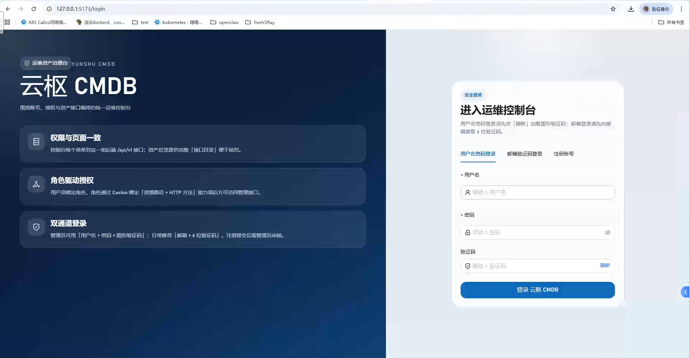
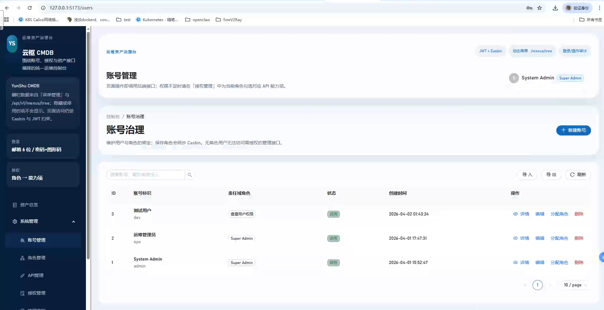
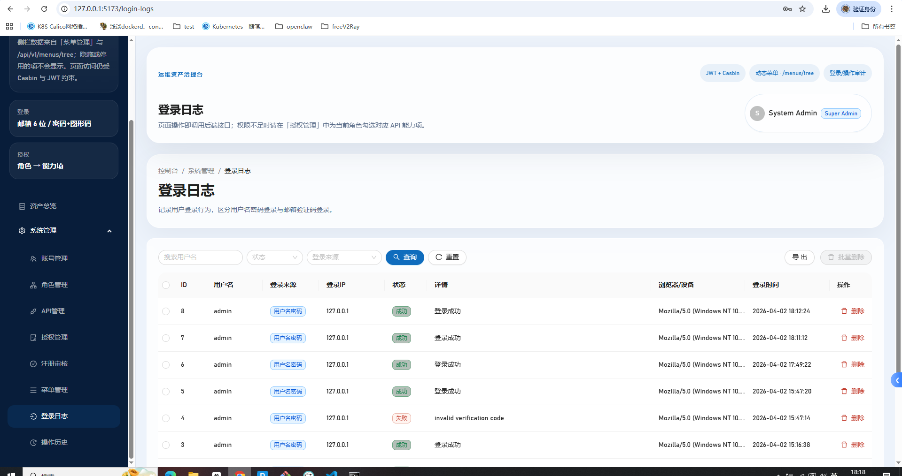
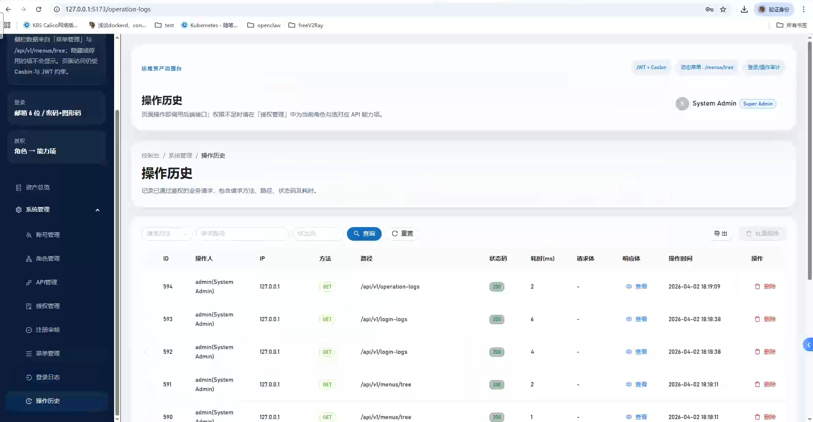

<p align="center">
  
</p>

# go-permission-system

**云枢 CMDB · 运维权限治理台** — 前后端分离的权限管理控制台（RBAC），适合作为企业资产 / CMDB 的权限底座。

<p align="center">
  <a href="https://go.dev/"></a>
  <a href="https://gin-gonic.com/"></a>
  <a href="https://react.dev/"></a>
  <a href="https://ant.design/"></a>
  <a href="https://casbin.org/"></a>
  <a href="https://www.mysql.com/"></a>
  <a href="https://redis.io/"></a>
</p>

---

## 项目亮点（概览）

- 前后端分离：Gin + React(Vite) + Ant Design。
- 基于 Casbin 的能力项（API × Method）权限控制，前端菜单可按权限动态展示。
- 操作审计：记录已鉴权请求（请求体、响应体、请求头、耗时），并支持导出为 Excel。
- 登录审计：记录登录来源、详情、User-Agent，并支持导出为 Excel（带筛选）。
- 批量导入/导出用户（Excel），便于迁移与管理员操作。

---

## 截图（示例）

> 本仓库 `images/` 可放置本地启动后拍摄的 PNG 截图；当前 README 使用 docs 下的示意 SVG。请按需替换为真实截图以在 GitHub 上更好展示。

| 登录 | 账号列表 | 登录日志 | 操作历史 |
|---:|:---:|:---:|:---:|
|  |  |  |  |

（如果你已经将本地截图上传到 `images/`，建议把表格中的 `docs/images/...` 改为 `images/...` 来展示真实像素）

---

## 完整功能（已实现）

- 认证：用户名/密码 + 图形验证码、邮箱验证码、JWT 会话。
- 账号管理：分页、查询、创建、编辑、分配角色、导入/导出（Excel）。
- 角色与权限：角色模板、权限树、Casbin 策略同步（角色 → 能力项）。
- API 能力管理：按资源路径（与 Gin 路由 path 对齐）与 HTTP 方法定义能力项。
- 授权管理：批量分配/回收策略、以 JSON 体方式撤销策略（兼容前端操作）。
- 登录日志导出：导出列包含 `ID, Username, IP, Source, Status, Detail, UserAgent, CreatedAt`（支持按 username/status/source 过滤）。
- 操作历史导出：导出列包含 `ID, Method, Path, StatusCode, LatencyMs, IP, RequestHeaders, RequestBody, ResponseBody, CreatedAt, User`（对请求/响应做脱敏与截断，避免泄露敏感字段）。

---

## 已补充 / 关键改进（本次更新说明）

1. 新增用户 Excel 导入/导出接口并实现前端按钮与联调。
2. 登录日志导出增加 `Detail` 与 `UserAgent` 字段（支撑问题排查）。
3. 操作历史导出增加 `IP、RequestHeaders、RequestBody、ResponseBody` 并在审计层对敏感字段（如 Authorization、Cookie）进行遮蔽与截断存储。
4. 将 Excel 依赖固定为与 Go 1.23 兼容的版本（在 go.mod 中声明）。

---

## 快速开始（开发环境）

### 前置依赖

| 组件 | 建议版本 |
|------|----------|
| Go | 1.23.x |
| Node.js | 18+ |
| MySQL | 5.7+ |
| Redis | 6+ |

### 本地运行（示例）

```bash
git clone <your-repo-url>
cd go-permission-system
go mod download

# 在 configs/config.yaml 中配置数据库/redis/jwt 等

# 建表（可选，server 启动时也会 AutoMigrate）
go run . migrate

# 填充初始数据（超级管理员、权限、菜单）
go run . seed

# 启动服务（默认 :8080）
go run . server

# 启动前端（在另一个终端）
cd web
npm install
npm run dev

# 打开 http://localhost:5173
```

### 常用 API（示例）

- 导出用户（返回 Excel）：

  GET /api/v1/users/export

- 导入用户（上传 Excel）：

  POST /api/v1/users/import (multipart/form-data file)

- 导出登录日志（支持筛选）:

  GET /api/v1/login-logs/export?username=admin&status=1&source=password

- 导出操作历史（支持筛选）:

  GET /api/v1/operation-logs/export?method=GET&path=/api/v1/users

（这些接口由后端流式写入 Excel 文件，前端使用 `responseType: 'blob'` 下载）

---

## 数据库迁移提示

- `go run . migrate` 会根据 `internal/bootstrap/AutoMigrateModels` 自动迁移模型。新增字段（如 `operation_logs.request_headers`）会在迁移时添加。生产环境迁移前请做好备份与回滚策略。

---

## 贡献与美化建议（在 GitHub 上更好展示）

1. 上传真实截图到仓库根 `images/`，并在 README 的截图表格中引用 `images/*.png`。
2. 添加 `demo.gif` 展示导出 Excel 的交互（动图更醒目）。
3. 配置 GitHub Actions 自动构建前端并把静态文件发布到 `gh-pages`（或把 `web/dist` 放入 Release），README 顶部展示实时 Demo 链接。
4. 在 README 顶部添加 `Release`、`License`、`Build`、`Go Report` 等状态徽章，提升项目可信度。

示例徽章（可按需替换）：

```md
[]()
[]()
```

---

## 项目结构（简要）

```
go-permission-system/
├── cmd/                    # server | migrate | seed
├── configs/                # config.yaml · casbin_model.conf
├── docs/                   # 文档与示意图
├── images/                 # 推荐：放置真实截图用于 README
├── internal/
│   ├── bootstrap/          # 依赖组装 · AutoMigrateModels
│   ├── handler/            # HTTP 层
│   ├── middleware/         # JWT · Casbin · 操作审计
│   ├── model/
│   ├── repository/
│   ├── service/
│   └── router/
└── web/                    # React 控制台
```

---

## 许可证

MIT License — 可自由用于学习与商业项目（请自行评估安全与合规）。
