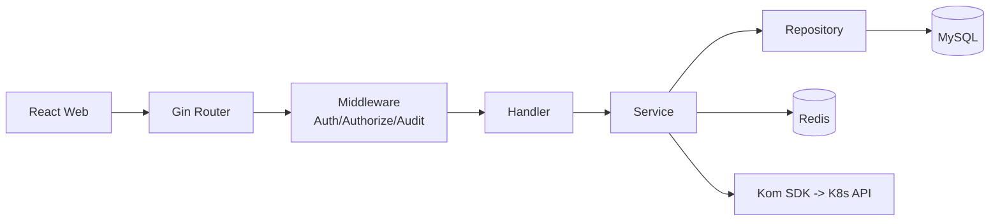
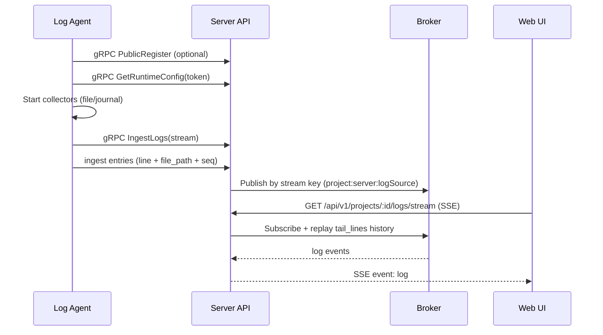

# yunshu

[](https://go.dev/)
[](https://gin-gonic.com/)
[](https://react.dev/)
[](https://ant.design/)
[](https://casbin.org/)
[](./LICENSE)

基于 **Go + React + Casbin + Kom SDK** 的权限与 Kubernetes 管理平台，支持：

- 传统 RBAC（用户/角色/API 权限）
- K8s 三元权限（cluster + namespace + action）
- 项目化日志平台（Log Source + Agent + 实时流 + 文件级筛选）

---

## 产品手册与部署文档

- **产品手册（需求 / 数据库 / 接口 / 权限）**：[docs/handbook/README.md](docs/handbook/README.md)  
- **麒麟 Kylin V10（x86_64）部署**：[docs/deployment/KYLIN_V10_X86_64.md](docs/deployment/KYLIN_V10_X86_64.md)

---

## 目录

- [1. 功能清单（Implemented Features）](#1-功能清单implemented-features)
- [2. 项目功能总览](#2-项目功能总览)
- [3. 技术栈与架构](#3-技术栈与架构)
- [4. 快速开始](#4-快速开始)
- [5. 日志平台设计与实现（重点）](#5-日志平台设计与实现重点)
- [6. 日志平台接口说明（详细）](#6-日志平台接口说明详细)
- [7. 日志平台验证流程（详细）](#7-日志平台验证流程详细)
- [8. Agent 启动命令（3种模式）](#8-agent-启动命令3种模式)
- [9. 常见问题与排障](#9-常见问题与排障)
- [10. 其他核心接口](#10-其他核心接口)
- [11. 项目结构](#11-项目结构)
- [12. 开发命令](#12-开发命令)

---

## 1. 功能清单（Implemented Features）

> 以下为当前代码中已实现并可用的功能模块，按 GitHub 常见 checklist 形式展示。

### 1.1 平台基础能力

- [x] 配置化启动（`server/migrate/seed` 命令）
- [x] MySQL + Redis 基础依赖接入
- [x] JWT 认证、登录态管理
- [x] 统一错误响应与审计中间件

### 1.2 权限与系统管理

- [x] 用户管理（增删改查、导入导出、角色绑定）
- [x] 角色管理（增删改查）
- [x] API 权限管理（resource + action）
- [x] Casbin 策略下发与回收
- [x] 注册审核流程
- [x] 菜单树管理（创建/编辑/删除/树查询）
- [x] 菜单内置修复与自动补齐（项目管理、告警通知、K8s 菜单）
- [x] 菜单同级排序自动去重（冲突自动顺延）
- [x] 登录日志、操作日志查询与清理
- [x] 封禁 IP 管理

### 1.3 K8s 管理能力

- [x] 集群管理（状态、命名空间、组件状态）
- [x] 核心资源：Pod / Namespace / Node
- [x] 工作负载：Deployment / StatefulSet / DaemonSet / CronJob / Job
- [x] 配置资源：ConfigMap / Secret
- [x] 网络资源：Service / Ingress / IngressClass / Event
- [x] 存储资源：PV / PVC / StorageClass
- [x] CRD / CR 动态资源管理
- [x] RBAC 资源管理（Role/RoleBinding/ClusterRole/ClusterRoleBinding）
- [x] K8s 三元权限（cluster + namespace + action）

### 1.4 日志平台（Project Logs）

- [x] 项目-服务器-服务-日志源模型
- [x] 日志源管理（Upsert + 删除）
- [x] Agent 公共注册（`register_secret`）
- [x] Agent token 鉴权 + runtime-config 下发
- [x] Agent WebSocket 日志上报（含 ACK/重发窗口）
- [x] Agent discovery 上报与平台查询
- [x] `file` 类型 Go 原生合并采集（非多 tail 子进程）
- [x] 支持文件路径元数据上报（`file_path`）
- [x] 前端 SSE 实时日志流
- [x] include/exclude regex 过滤
- [x] highlight 关键字高亮
- [x] 文件级筛选（日志文件下拉）
- [x] 无新增写入时历史回放（`tail_lines`）
- [x] Agent 运行日志增强（默认 info + `--debug`）

### 1.5 前端能力

- [x] React + TS + Vite 单页应用
- [x] 动态菜单加载与页面路由
- [x] 日志平台终端式显示（xterm）
- [x] 日志平台流状态/Agent 状态面板

---

## 2. 项目功能总览

### 1.1 权限与系统管理

- 认证登录：用户名密码、邮箱验证码、JWT
- 用户与角色：用户管理、角色分配、导入导出
- API 权限：资源路径 + HTTP 动作
- Casbin 授权：策略授予与回收
- 菜单管理：动态菜单树、动态路由
- 安全审计：登录日志、操作日志、封禁 IP

### 1.2 Kubernetes 运维管理

- 集群：增删改查、启停、状态、组件状态
- 核心资源：Pod / Namespace / Node
- 工作负载：Deployment / StatefulSet / DaemonSet / Job / CronJob
- 配置与网络：ConfigMap / Secret / Service / Ingress / IngressClass / Event
- 存储：PV / PVC / StorageClass
- 扩展：CRD / CR 动态管理
- RBAC 资源管理

### 1.3 日志平台（本次重点能力）

- 项目-服务器-服务-日志源模型
- Agent 向平台注册并拉取运行配置
- Agent 本地采集日志并通过 WS 上报
- 平台通过 SSE 向前端实时推流
- 支持 include/exclude/highlight、文件级筛选
- 支持“无新写入时回放最近历史日志”

---

## 3. 技术栈与架构

### 2.1 技术栈

- 后端：Go, Gin, GORM, Casbin, Redis, MySQL
- 前端：React 18, TypeScript, Vite, Ant Design
- K8s：Kom SDK
- 实时通信：WebSocket（Agent->Server）, SSE（Server->Web）

### 2.2 后端分层架构图



---

## 4. 快速开始

### 3.1 环境要求

- Go >= 1.23
- Node.js >= 18
- MySQL >= 5.7
- Redis >= 6

### 3.2 启动步骤

```bash
git clone <your-repo-url>
cd yunshu

go mod download
cd web && npm install && cd ..

go run . migrate
go run . seed

# 后端
go run . server

# 前端（新终端）
cd web && npm run dev
```

默认地址：

- 前端：`http://localhost:5173`
- 后端：`http://localhost:8080`
- Swagger：`http://localhost:8080/swagger/index.html`

---

## 5. 日志平台设计与实现（重点）

### 4.1 核心流程图



### 4.2 日志平台分层

- **配置层**：`Project -> Server -> Service -> LogSource`
- **采集层**：`internal/agent`
  - `runtime.go`: 注册/拉配置/gRPC stream 上报/ACK重发
  - `file_collector.go`: Go 原生文件采集（支持 glob + 多文件合并）
- **汇聚层**：`internal/service/log_agent_service.go`
  - `AgentLogBroker` 按 `project:server:logSource` 组织流
  - 内存历史缓冲（用于订阅时回放 tail）
- **展示层**：`web/src/pages/project-logs-page.tsx`
  - SSE 连接 + 过滤条件 + 文件下拉筛选

### 4.3 关键实现点

1. **file 合并采集（Go 原生）**
   - 不再为每个文件起外部 `tail` 子进程
   - 支持 glob 匹配、轮转/截断处理、增量偏移跟踪

2. **文件维度元数据**
   - Agent 上报 `entries[]`，每条包含 `line` + `file_path`
   - 前端可按具体文件过滤查看

3. **无新写入也可看日志**
   - 订阅 SSE 时先回放历史缓冲（按 `tail_lines`）
   - 然后再接实时日志

4. **可观测性增强**
   - Agent 默认输出启动、连接、配置加载、运行状态日志
   - `--debug` 输出采集细节与异常细节

5. **动态 discovery（非写死目录）**
   - 由下发 `log_source.path` 动态发现可选文件
   - 支持 glob/目录/单文件三种模式

---

## 6. 日志平台接口说明（详细）

以下接口均为 `/api/v1` 前缀。

### 5.1 日志源配置（平台侧）

| Method | Path | 说明 |
|---|---|---|
| GET | `/projects/:id/log-sources` | 查询日志源列表 |
| POST | `/projects/:id/log-sources` | 新建/更新日志源（Upsert） |
| DELETE | `/projects/:id/log-sources/:logSourceId` | 删除日志源 |

日志源主要字段：

- `service_id`
- `log_type`（`file` / `journal`）
- `path`（支持文件、目录、glob）
- `status`

### 5.2 Agent 生命周期接口

| Method | Path | 说明 |
|---|---|---|
| POST | `/agents/public-register` | 兼容 HTTP 公共注册（内部转调 gRPC） |
| GET | `/agents/runtime-config?token=...` | 兼容 HTTP 拉取配置（内部转调 gRPC） |
| POST | `/agents/discovery/report` | 兼容 HTTP discovery 上报（内部转调 gRPC） |
| gRPC | `AgentRuntimeService/IngestLogs` | Agent 双向流日志上报 |

项目侧运维接口：

| Method | Path | 说明 |
|---|---|---|
| GET | `/projects/:id/agents/status` | Agent 在线与最近上报状态 |
| POST | `/projects/:id/agents/bootstrap` | 生成 agent 部署命令与 token |
| POST | `/projects/:id/agents/rotate-token` | 轮换 token |
| GET | `/projects/:id/agents/discovery` | 查询可选日志文件（供前端下拉） |

### 5.3 日志流接口（前端消费）

| Method | Path | 说明 |
|---|---|---|
| GET | `/projects/:id/logs/stream` | SSE 实时日志流（含历史回放） |

查询参数：

- `server_id`（required）
- `log_source_id`（required）
- `tail_lines`（可选，默认 200）
- `include`（可选，regex）
- `exclude`（可选，regex）
- `highlight`（可选，关键字）
- `file_path`（可选，指定日志文件）
- `source=agent`

SSE 输出示例：

```json
event: log
data: {"line":"...","file_path":"/var/log/pods/.../0.log"}
```

---

## 7. 日志平台验证流程（详细）

### 6.1 配置准备

1. 在“项目管理”中创建：
   - 项目
   - 服务器
   - 服务
   - 日志源（`log_type=file`，`path` 可为 `*.log`）
2. 获取 agent token（bootstrap/rotate token）

### 6.2 启动平台

```bash
go run . server
cd web && npm run dev
```

### 6.3 启动 Agent（Linux）

```bash
./log-agent \
  --grpc-server "<platform-host>:18080" \
  --project-id 1 \
  --server-id 1 \
  --token "<agent-token>" \
  --debug
```

应看到类似日志：

- `[agent][info] starting agent ...`
- `[agent][info] runtime-config loaded project=... sources=...`
- `[agent][info] ingest stream connected`
- `[agent][info] running sources=... received=... sent=... pending=...`

### 6.4 页面验证点

在“日志平台”页面依次验证：

1. 选择 `项目 / 服务器 / 服务 / 日志源`
2. “日志文件”下拉是否出现匹配文件（来自 discovery）
3. 点击“开始”后：
   - 有新写入时，实时显示
   - 无新写入时，仍可看到最近历史（tail 回放）
4. 验证 `include/exclude/highlight` 生效
5. 切换 `file_path` 后只显示该文件日志

### 6.5 回归验证建议

- file + glob（如 `/var/log/pods/.../*.log`）
- file + 目录
- file + 单文件
- 轮转文件场景（新文件出现后是否继续采集）
- Agent 重启后是否可恢复流

---

## 8. Agent 启动命令（3种模式）

> 与 `docs/log-platform-api.md` 保持一致，便于快速复制使用。

### 8.1 Token 标准模式（推荐）

```bash
./log-agent \
  --grpc-server "10.10.10.1:18080" \
  --project-id 1 \
  --server-id 1 \
  --token "xxxxxxxxxxxxxxxx"
```

### 8.2 Token + 调试模式

```bash
./log-agent \
  --grpc-server "10.10.10.1:18080" \
  --project-id 1 \
  --server-id 1 \
  --token "xxxxxxxxxxxxxxxx" \
  --debug
```

### 8.3 Fallback 单日志源模式

```bash
./log-agent \
  --grpc-server "10.10.10.1:18080" \
  --project-id 1 \
  --server-id 1 \
  --token "xxxxxxxxxxxxxxxx" \
  --log-source-id 9 \
  --source-type file \
  --path "/var/log/pods/.../*.log" \
  --tail-lines 300
```

---

## 9. 常见问题与排障

### 7.1 Agent 启动无输出

- 使用最新版二进制（已包含默认 info 日志）
- 如需细节，加 `--debug`
- 检查 `grpc-server`、`token`、网络连通性

### 7.2 页面无日志

- 确认 Agent 在线且 `recent_publishing=true`
- 检查 `server_id/log_source_id` 是否对应
- 检查日志文件权限与路径匹配
- 检查是否被 `include/exclude` 过滤掉

### 7.3 “日志文件”下拉为空

- Agent 需先成功上报 discovery
- 重启 agent 后刷新页面
- 确认 log source `path` 与实际文件匹配

### 7.4 无新写入时看不到日志

- 确认 `tail_lines > 0`
- 当前版本已支持订阅时历史回放

---

## 10. 其他核心接口

> 完整接口请以 `internal/router/router.go` 与 Swagger 为准。

### 8.1 认证与系统

- `POST /auth/login`
- `POST /auth/register`
- `GET /auth/me`
- `GET /menus/tree`
- `GET /overview`

### 8.2 用户/角色/权限

- `GET/POST/PUT/DELETE /users`
- `GET/POST/PUT/DELETE /roles`
- `GET/POST/PUT/DELETE /permissions`
- `GET/POST/DELETE /policies`

### 8.3 K8s 资源（示例）

- `/clusters`, `/pods`, `/deployments`, `/statefulsets`, `/daemonsets`
- `/cronjobs`, `/jobs`, `/configmaps`, `/secrets`
- `/k8s-services`, `/ingresses`, `/events`
- `/crds`, `/crs`, `/rbac/*`

---

## 11. 项目结构

```text
yunshu/
├── cmd/                      # 命令入口（server/migrate/seed/logagent）
├── configs/                  # 配置文件
├── internal/
│   ├── agent/                # log-agent 运行时与采集器
│   ├── bootstrap/            # 应用初始化
│   ├── handler/              # HTTP 入口
│   ├── middleware/           # 认证/鉴权/审计
│   ├── model/                # 数据模型
│   ├── repository/           # 数据访问层
│   ├── router/               # 路由注册
│   └── service/              # 业务逻辑层
├── web/                      # 前端 React 工程
└── docs/                     # 扩展文档
```

---

## 12. 开发命令

```bash
# 后端测试
go test ./...

# 启动后端
go run . server

# 数据迁移与初始化
go run . migrate
go run . seed

# 前端开发
cd web && npm run dev

# 前端构建
cd web && npm run build
```

---

## License

MIT

