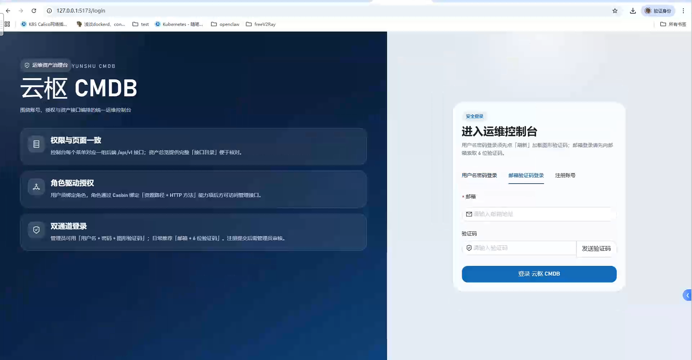
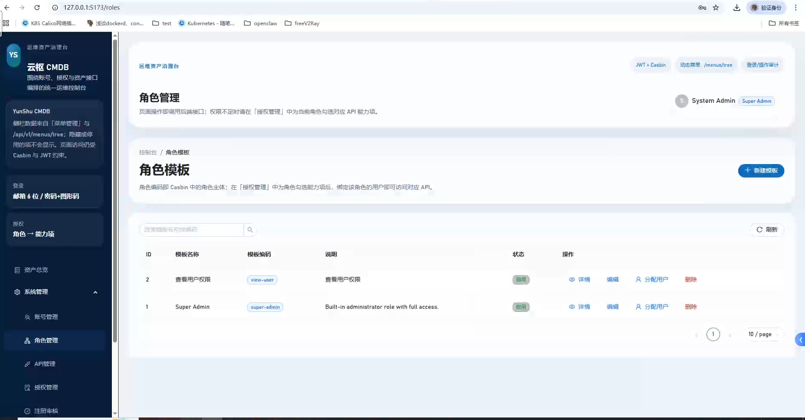
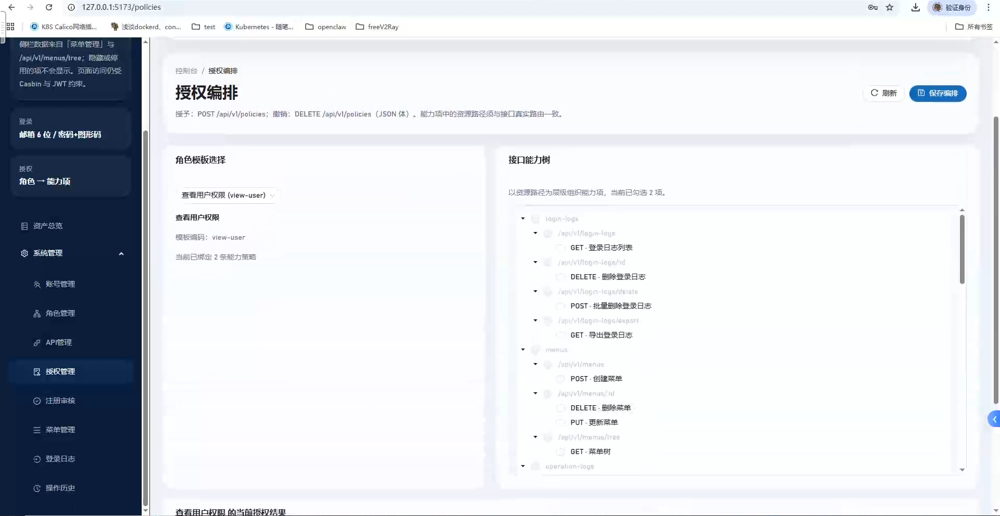
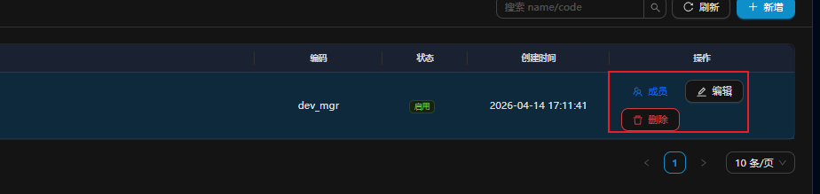
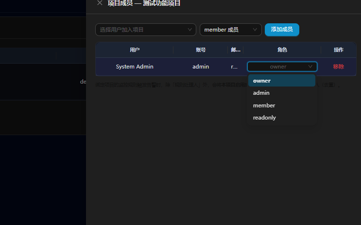
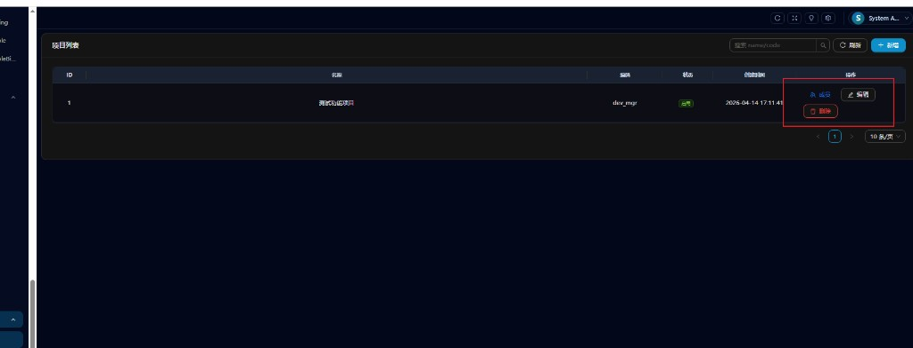
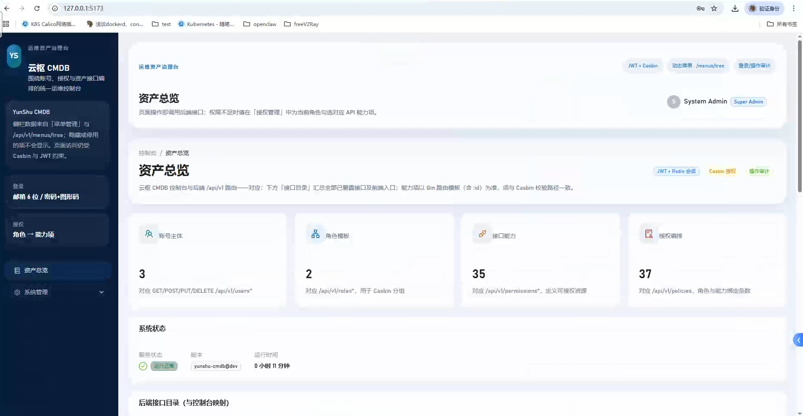
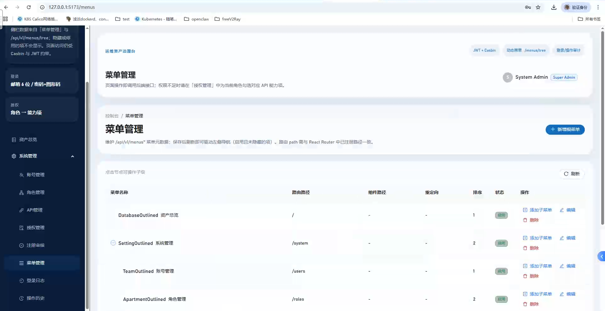

# Yunshu

[](https://go.dev/)
[](https://react.dev/)
[](https://ant.design/)
[](./LICENSE)

Yunshu is a Go + React based platform for:

- Kubernetes resource management
- RBAC/Casbin based permission management
- Project-based alerting and log platform
- Audit and operation observability

---

## Table of Contents

- [Key Features](#key-features)
- [Feature Screenshots](#feature-screenshots)
- [Tech Stack](#tech-stack)
- [Quick Start](#quick-start)
- [Project Structure](#project-structure)
- [Documentation](#documentation)

---

## Key Features

- User, role, menu, permission and policy management
- Kubernetes resources management (Pod/Deployment/StatefulSet/DaemonSet/Job/CronJob/Service/Ingress/ConfigMap/Secret/PV/PVC/StorageClass/CRD/CR)
- K8s scoped authorization model (cluster + namespace + action)
- Alert platform with project-scoped datasource/rules and duty integration
- Log Agent runtime configuration, streaming ingest, SSE live logs, and file-level filtering
- Login log and operation log auditing

---

## Feature Screenshots

### Authentication and Access







### Project and Member Management




### Alert and Monitoring



### System and Navigation





---

## Tech Stack

- Backend: Go, Gin, GORM, Casbin, Redis, MySQL
- Frontend: React 18, TypeScript, Vite, Ant Design
- Kubernetes: Kom SDK
- Streaming: WebSocket (agent ingest), SSE (web log stream)

---

## Quick Start

### Requirements

- Go >= 1.23
- Node.js >= 18
- MySQL
- Redis

### Run Locally

```bash
git clone <your-repo-url>
cd yunshu

go mod download
cd web && npm install && cd ..

go run . migrate
go run . seed
go run . server
```

In a new terminal:

```bash
cd web
npm run dev
```

Default endpoints:

- Frontend: `http://localhost:5173`
- Backend: `http://localhost:8080`
- Swagger: `http://localhost:8080/swagger/index.html`

---

## Project Structure

```text
yunshu/
├── cmd/          # entry commands: server/migrate/seed/logagent
├── configs/      # configuration files
├── docs/         # docs and handbook
├── images/       # README screenshots
├── internal/     # core backend code
└── web/          # frontend app
```

---

## Documentation

- Product handbook: [docs/handbook/README.md](docs/handbook/README.md)
- Deployment guide: [docs/deployment/KYLIN_V10_X86_64.md](docs/deployment/KYLIN_V10_X86_64.md)
- Alert notification guide: [docs/alert-notify-guide.md](docs/alert-notify-guide.md)

