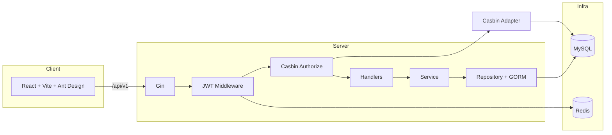

<p align="center">
  
</p>

<h1 align="center">go-permission-system</h1>

<p align="center">
  <strong>云枢 CMDB · 运维权限治理台</strong> — 前后端分离的 RBAC 控制台，可作为企业资产 / CMDB 的权限底座。
</p>

<p align="center">
  <a href="https://go.dev/"></a>
  <a href="https://gin-gonic.com/"></a>
  <a href="https://react.dev/"></a>
  <a href="https://ant.design/"></a>
  <a href="https://casbin.org/"></a>
  <a href="https://www.mysql.com/"></a>
  <a href="https://redis.io/"></a>
</p>

---

## 预览 · Screenshots

> 下列为仓库内 **SVG 示意**（矢量、可无损缩放）。若需真实像素级截图，可在本地启动后自行替换为 `PNG` 并更新路径。

| 登录（双通道） | 资产总览 · 接口目录 |
| :---: | :---: |
|  |  |

| 菜单管理（驱动侧栏） |
| :---: |
|  |

---

## 功能矩阵

| 模块 | 能力摘要 | 后端前缀 |
|------|----------|----------|
| **认证** | 用户名密码 + 图形码、邮箱 6 位验证码、注册申请、JWT + Redis 会话 | `/api/v1/auth/*` |
| **账号** | CRUD、分页、分配多角色（同步 Casbin `g`） | `/api/v1/users` |
| **角色** | CRUD、角色编码即 Casbin 角色名 | `/api/v1/roles` |
| **API 能力** | 资源路径 × HTTP Method，与 Gin `FullPath` 对齐 | `/api/v1/permissions` |
| **授权** | 授予 POST、撤销 **DELETE `/api/v1/policies`（JSON 体）** | `/api/v1/policies` |
| **注册审核** | 列表筛选、通过/拒绝 | `/api/v1/registrations` |
| **菜单** | 树形 CRUD、`hidden`/`status`、**侧栏动态加载 `/menus/tree`** | `/api/v1/menus` |
| **登录日志** | 成功/失败、来源 `password` / `email` | `/api/v1/login-logs` |
| **操作历史** | 已鉴权请求审计（请求/响应截断 + 脱敏） | `/api/v1/operation-logs` |
| **运维** | 健康检查、启动时 **AutoMigrate**、分级日志、Swagger | `/api/v1/health`、`/swagger/*` |

---

## 菜单管理：实现说明与完善项

**后端**

- `GET /menus/tree`：`ListAll` 后内存拼树；删除前校验子节点数量。
- **已修复**：`CountChildren` 原错误使用 `Count` 返回值，导致子查询计数不可用（已改为 `.Count(&count).Error`）。
- **已修复**：`Update` 中 `status` 使用指针字段，避免「未传 status 却被写成 0」误停用菜单。
- `DELETE`：有子菜单时返回明确错误；记录不存在返回 404。

**前端**

- 表格 + 展开行管理树；支持根菜单 / 子菜单、编辑、删除。
- **已完善**：控制台侧栏在登录后请求 **`getMenuTree()`**，按 `status === 1` 且 **非 hidden** 渲染；图标名为 Ant Design Icons 导出名（如 `SettingOutlined`）。请求失败时回退到内置静态菜单。
- **约束**：`path` 必须与 `web/src/app/app.tsx` 中已声明的 `<Route>` 一致，否则点击会 404；新增页面需同时加路由与菜单数据。

**可选后续增强**（未实现）

- 菜单与 Casbin 能力绑定，实现「无权限则不展示菜单项」。
- 编辑菜单时可视化调整父级（防环校验）。
- `component` 字段与前端懒加载组件映射（微前端场景）。

---

## 架构



---

## 快速开始

### 依赖

| 组件 | 版本 |
|------|------|
| Go | ≥ 1.23 |
| Node.js | ≥ 18 |
| MySQL | ≥ 5.7 |
| Redis | 推荐 6+ |

### 命令

```bash
git clone <your-repo-url> go-permission-system
cd go-permission-system
go mod download

# 配置 configs/config.yaml 中的 mysql / redis / mail / auth.jwt_secret

go run . migrate   # 建表（亦可在首次 server 启动时自动执行 AutoMigrate）
go run . seed      # 超级管理员、权限、菜单种子；升级后请重复执行以合并新权限

go run . server    # 默认 :8080

cd web && npm install && npm run dev   # 默认 :5173，代理 /api → 后端
```

### 默认账号

- 用户名：`admin`  
- 密码：`Admin@123`（请在生产环境立即修改）

### 常用链接

| 环境 | URL |
|------|-----|
| 前端开发 | http://localhost:5173 |
| API 基座 | http://localhost:8080/api/v1 |
| Swagger | http://localhost:8080/swagger/index.html |

---

## 项目结构（节选）

```
go-permission-system/
├── cmd/                    # server | migrate | seed
├── configs/                # config.yaml · casbin_model.conf
├── docs/images/            # README 配图（SVG）
├── internal/
│   ├── bootstrap/          # 依赖组装 · AutoMigrateModels
│   ├── handler/            # HTTP 层
│   ├── middleware/       # JWT · Casbin · 操作审计
│   ├── model/
│   ├── repository/
│   ├── service/
│   └── router/
└── web/                    # React 控制台
```

---

## 开发脚本

```bash
go fmt ./...
go vet ./...
go build -o bin/app .

cd web && npm run build     # 静态资源输出 web/dist
```

---

## 许可证

MIT License — 可自由用于学习与商业项目（请自行评估安全与合规）。
