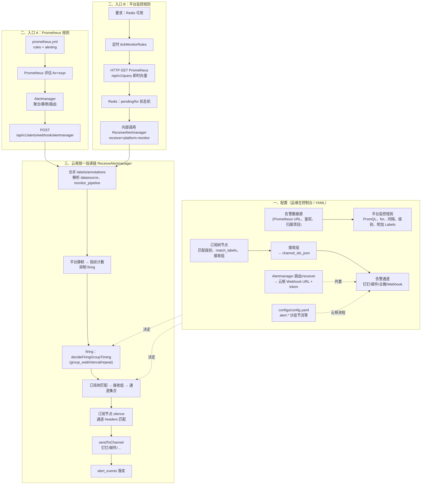
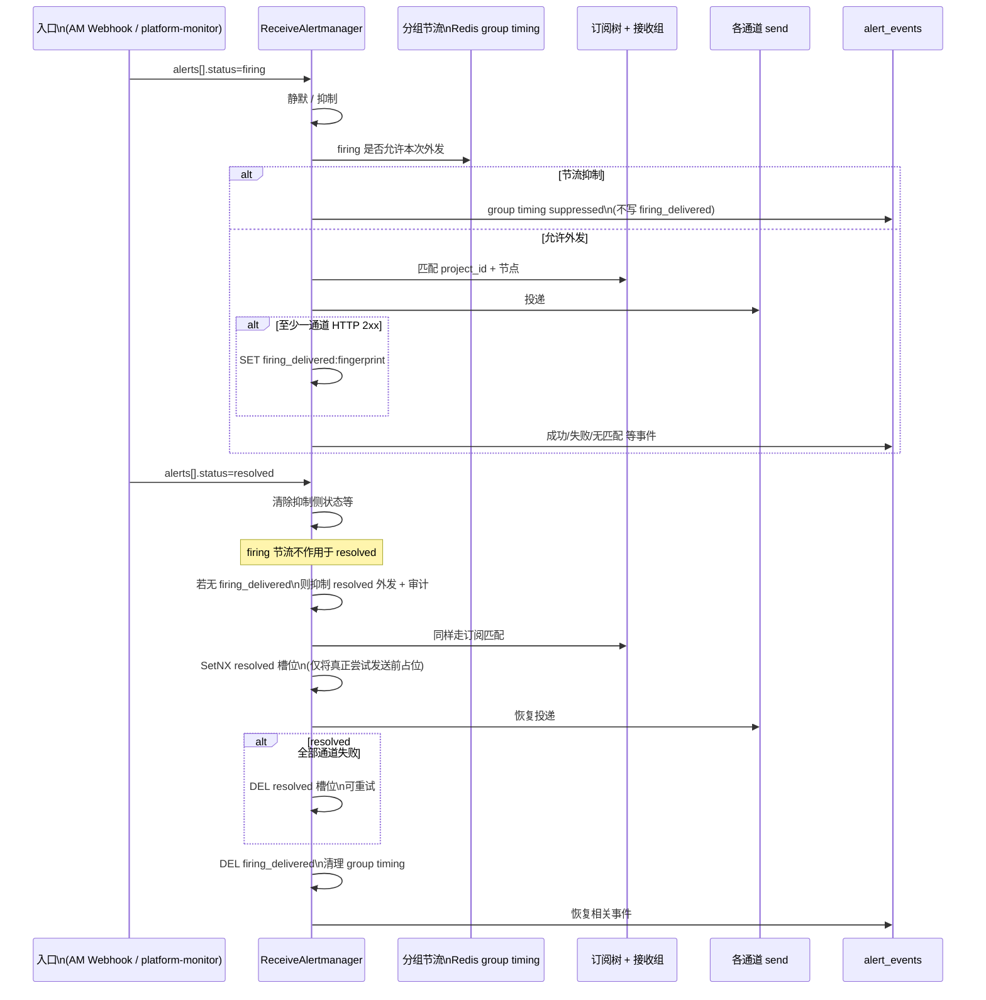

# 告警路由与投递：配置说明与端到端链路

本文回答：**订阅树怎么配、`match_labels_json` 怎么配、Prometheus 规则与平台规则 labels 怎么配、整条链路如何走通、值班如何参与、只启用一个订阅节点时如何投递**，以及 **「只有恢复没有触发」是否正常**（含实现上的修复说明）。

更细的「标签键约定」见：[告警订阅标签链路约定](./alert-subscription-labels-chain.md)。

---

## 0. 完整告警链路图（配置 → firing 外发 → 恢复外发）

以下为与当前实现一致的**两条入口**（云枢只统一走 `ReceiveAlertmanager` 处理体；**平台规则不经过 Alertmanager**）。

### 0.1 总览（配置面 + 运行面）



### 0.2 `firing` 与 `resolved` 在云枢内的顺序（同一指纹）



### 0.3 配置与运行时对应表

| 阶段 | 配置落点 | 运行时行为 |
|------|-----------|------------|
| 指标从哪来 | 数据源 `BaseURL` | PromQL 查询或 Prometheus 自告警 |
| 何时算「触发」 | 规则 `for` / 平台 `for_seconds` | Prometheus 或 Redis 状态机 |
| 谁决定「第一次/重复发」间隔 | `configs/config.yaml` → `alert.group_*` | `decideFiringGroupTiming`（**仅 firing**，需 Redis） |
| 走哪个钉钉/邮件 | 订阅树 + 接收组 + 通道 | `channelIDSetForAlert` → `sendToChannel` |
| 邮件收件人 | 规则处理人、值班、`assignee_emails` | 邮件通道 `mergeAssigneeEmails` |
| 恢复只发一次 | DedupTTL 内 `alert:resolved:sent:*` | `markResolvedNotificationSent`（**占位在订阅等检查通过之后**） |
| 恢复是否允许外发 | 无额外配置 | 须曾 **`firing_delivered`**（成功 2xx），否则审计抑制 |

### 0.4 与 Alertmanager 的职责分界

| 能力 | Alertmanager（外置） | 云枢 `ReceiveAlertmanager` |
|------|----------------------|---------------------------|
| 静默 | AM 侧 matcher | 平台「告警静默」表 |
| firing 聚合间隔 | `route` 上 `group_wait` 等 | `config.yaml` 第二层 + Redis |
| 路由到钉钉 | AM `receiver` → Webhook | 订阅树 → 接收组 → 多通道 |
| 平台 PromQL 规则 | **不参与** | 直连 Prometheus API + 内部 payload |

---

## 1. 订阅树路由（节点）怎么配置

1. **按项目建根**：每个业务项目在「订阅树」下维护一棵或多棵根节点；告警必须带 **`project_id`**（字符串数字），后端据此选树。
2. **每个节点**配置：
   - **启用**：关闭则该节点不参与匹配。
   - **匹配级别**（`match_severity`）：与告警 **`labels["severity"]`** 比较；**不选表示不按级别过滤**。
   - **`match_labels_json`**：精确匹配，键值必须与告警 labels 完全一致（见第 2 节）。
   - **`match_regex_json`**（可选）：对指定 label 做正则匹配。
   - **接收组**：命中后从接收组解析 **通道 ID 列表**（钉钉、邮件等）；根节点可仅作分流、子节点挂接收组亦可。
   - **静默秒数 / 恢复通知**：控制命中后的订阅级静默与是否发 resolved。

子节点与父节点条件为 **AND** 组合（先父后子，递归匹配）；若节点开启 **继续匹配子节点**，命中后仍会向下尝试子节点。

---

## 2. `match_labels_json` 怎么配置

- 写成合法 JSON，例如：`{"cluster":"prodK8s","route":"prod-critical-dingding"}`。
- **只写路由维度**即可；**级别建议用「匹配级别」勾选**，避免在 JSON 里再写一遍 `severity` 导致与代码只认 `severity` 键不一致。
- **禁止错拼键名**（如 `sevrity`）；必须与 Prometheus / 平台规则最终 labels 中的键名一致。
- **每多写一个键**，告警侧就必须能提供该键且值相等；常用组合：`cluster` + `route`；若希望强校验项目，也可加 `project_id`（与 `external_labels` 一致即可）。

---

## 3. Prometheus `rules` 与平台监控规则的 labels 怎么配置

### 3.1 Prometheus 规则（经 Alertmanager → Webhook）

- **`project_id`**：与云枢项目 ID 一致（可在 `prometheus.yml` 的 `global.external_labels` 统一写）。
- **`severity`**：与订阅树「匹配级别」一致。
- **订阅树 `match_labels_json` 中出现的每一个键**：在规则 `labels` 或 `external_labels` 中补齐（如 `cluster`、`route`）。

### 3.2 平台监控规则（「附加 Labels JSON」）

后端会先注入：`alertname`、`severity`、`monitor_rule_id`、`datasource_id`、`project_id`、`source`、`datasource_*`，再 **合并** 你填的附加 JSON（同键则覆盖）。

- **必须补**：订阅树要求、但平台不会自动生成的键（常见 **`cluster`、`route`**；`project_id` 一般已由数据源推导，无需重复）。
- **不要**在附加 JSON 里写 `alertname`、`datasource_id` 等已由系统填充的字段（除非有意覆盖）。

平台规则评估依赖 **Redis**；无 Redis 时不会按间隔评估。

---

## 4. 端到端：如何形成「匹配 → 发送」链路

```text
[触发]
  Prometheus 规则(for+expr) → Alertmanager → POST /api/v1/alerts/webhook/alertmanager
  或
  平台规则(PromQL+for_seconds+Redis) → 内部 ReceiveAlertmanager(receiver=platform-monitor)

[进站]
  ReceiveAlertmanager：合并 labels、静默、抑制、组装 outgoing

[firing 时序收敛]
  config.yaml 中 alert.group_wait_seconds / group_interval_seconds / repeat_interval_seconds
  （需 Redis；见 decideFiringGroupTiming）

[订阅路由]
  project_id → 选根 → 各节点：匹配级别 AND match_labels AND match_regex
  → 接收组（在生效时间内）→ 通道 ID 集合

[通道发送]
  按通道类型发钉钉/企微/邮件等；邮件通道对「处理人邮箱」有特殊合并逻辑（见第 5 节）

[落库]
  alert_events 记录每次外发或抑制原因
```

---

## 5. 平台规则里配置了「值班」时，告警如何实现

1. 监控规则触发 firing 且通过订阅匹配后，在投递前会调用 **`enrichAssigneeAndDutyEmails`**：根据 `monitor_rule_id` 合并 **处理人邮箱** 与 **当前时刻值班班次邮箱**，写入 payload 的 **`assignee_emails`**。
2. **仅邮件通道**读取 `assignee_emails`：若非空，则 **只向这些地址发信**，并忽略邮件通道里配置的固定收件人（见 `mergeAssigneeEmails` 注释）。
3. **钉钉 / 企微等 Webhook**：仍发到机器人或应用；**@谁** 由通道配置里的 **`atMobiles` / `atUserIds`** 决定，**不会**自动用值班邮箱替换钉钉收件人。

因此：值班主要增强 **邮件侧收件人**；要钉钉 @ 到人，需在钉钉通道里配置手机号等。

---

## 6. 只启用一个订阅树节点时，告警如何发送

- **不需要**多个节点同时启用；只要告警 **labels 能命中这一条** 即可。
- 命中后，该节点绑定的 **接收组 → 多个通道** 可同时投递（例如钉钉 + 邮件，取决于接收组 `channel_ids_json`）。
- 其它节点全部停用，仅表示没有其它分流路径；不会阻止这一条发送。

---

## 7. 「没有触发通知，却先收到恢复」——这对吗？

**从产品语义上不对**：用户应至少收到一次 **firing**（或明确写库的「抑制/无通道」说明），再收到 **resolved**。

**原因（实现层面，已修复）**：`firing` 在出站前会经过 **`decideFiringGroupTiming`**（`config.yaml` 的 group_wait / group_interval / repeat_interval），可能被标记为「分组节流抑制」而 **不实际发通道**；**`resolved` 原先不经过同一套节流**，仍可能走通道外发，从而出现「只有恢复」的错觉。

**修复策略**（当前代码）：在 Redis 可用时，若某 `fingerprint` **从未成功向任一通道投递过 firing**（HTTP 2xx），则 **抑制 resolved 的外发**，并写入一条审计事件，`error_message` 为 **`resolved_no_prior_firing_delivery`**。无 Redis 时保持旧行为（不拦截），避免破坏无 Redis 部署。

若仍只看到恢复、没有该抑制事件，请核对：**历史里是否有一条 firing 被标为「分组节流抑制」**（`group timing suppressed`），或 firing 是否落在其它筛选条件之外。

---

## 8. 其它实现要点（排障）

### 8.1 恢复通知去重（`markResolvedNotificationSent`）占位时机

`alert:resolved:sent:{fingerprint}` **仅在**通过静默、抑制、firing 分组节流、订阅匹配、路由静默、**「无成功 firing 投递则不发 resolved」** 等检查**之后**、真正尝试调用各通道之前才占位。若最终 **所有通道均未返回 HTTP 2xx**，会 **清除** 该占位，以便后续再次收到 `resolved` 时可重试外发。避免出现「未外发却占住恢复槽」导致永不重试。

### 8.2 全部通道外发失败（firing / resolved）

当订阅已匹配且至少选中了一个通道并尝试 `sendToChannel`，但 **全部返回非 2xx 或 error** 时，会额外写入一条 `error_message` = **`all_channel_delivery_failed`** 的审计事件（标题带 `(all channel delivery failed)`），与「未选中任何通道」（`sentCount == 0`）区分。

### 8.3 平台监控规则与 Redis

`tickMonitorRules` 仅在 **`s.redis != nil`** 时才会调用 `evaluateOneMonitorRule`：平台规则的 **for 状态机、评估节拍、分布式锁** 依赖 Redis。未配置 Redis 时，**已启用的平台监控规则不会被执行**（设计约束）；请为运行告警后端的环境配置 Redis。

---

## 相关代码入口（便于二次开发）

| 能力 | 文件与要点 |
|------|------------|
| 订阅树匹配 | `internal/service/alert_subscription_service.go`：`nodeMatches`、`MatchRouteDetailed` |
| 接收组 → 通道 | `internal/service/alert_service.go`：`channelIDSetForAlert` |
| firing 分组节流 | `internal/service/alert_aggregate_state.go`：`decideFiringGroupTiming` |
| firing 成功投递标记 / resolved 拦截 | 同上：`markAlertFiringDelivered`、`alertFiringWasDelivered`、`logResolvedSuppressedNoPriorFiringDelivery`；`ReceiveAlertmanager` 内发送循环 |
| 平台规则 for | `internal/service/alert_monitor_redis.go`：`evaluateMonitorRuleWithRedis` |
| 值班邮箱合并 | `internal/service/alert_service.go`：`enrichAssigneeAndDutyEmails`；`internal/service/alert_delivery.go`：`mergeAssigneeEmails` |
