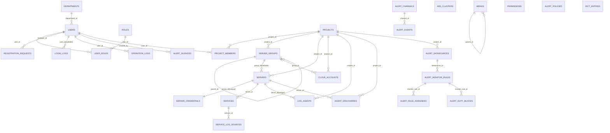
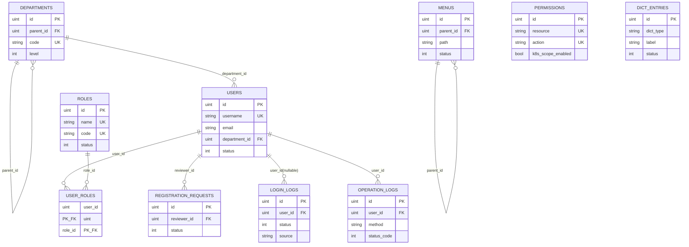
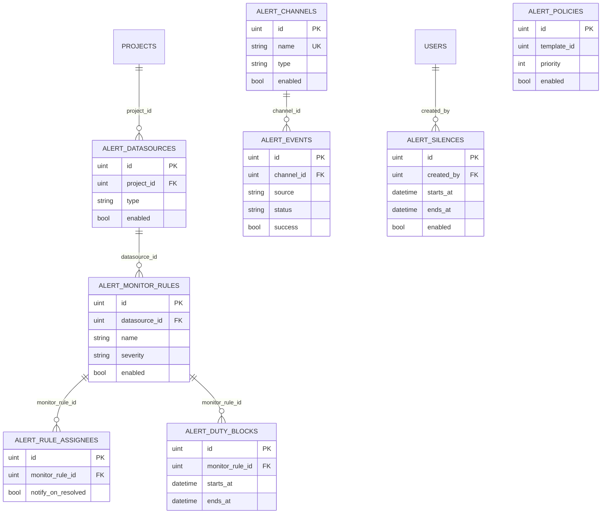
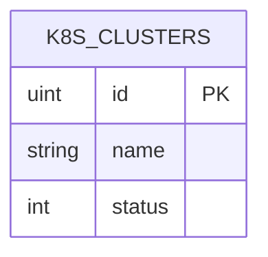

# 数据库 ER 图（精细版）

> 数据库名：`permission_system`  
> 数据来源：`internal/model/` 全量模型（含 32 个 model 文件中的业务实体）。

## 总览图



## 1) 系统管理子图



### 查询入口 SQL 示例（系统管理）

```sql
-- 入口1：按用户名查看账号、部门、角色（排障“为什么看不到菜单/接口”）
SELECT
  u.id,
  u.username,
  u.nickname,
  u.status AS user_status,
  d.name AS department_name,
  r.code AS role_code,
  r.name AS role_name
FROM users u
LEFT JOIN departments d ON d.id = u.department_id AND d.deleted_at IS NULL
LEFT JOIN user_roles ur ON ur.user_id = u.id
LEFT JOIN roles r ON r.id = ur.role_id AND r.deleted_at IS NULL
WHERE u.username = ? AND u.deleted_at IS NULL
ORDER BY r.code;

-- 入口2：按用户追最近登录与操作日志（onboarding 常用）
SELECT
  ll.created_at,
  ll.source,
  ll.status,
  ll.ip,
  ll.detail
FROM login_logs ll
WHERE ll.user_id = ?
ORDER BY ll.created_at DESC
LIMIT 20;

SELECT
  ol.created_at,
  ol.method,
  ol.path,
  ol.status_code,
  ol.latency_ms
FROM operation_logs ol
WHERE ol.user_id = ?
ORDER BY ol.created_at DESC
LIMIT 50;
```

## 2) 项目管理子图

```mermaid
erDiagram
  PROJECTS ||--o{ PROJECT_MEMBERS : "project_id"
  USERS ||--o{ PROJECT_MEMBERS : "user_id"
  PROJECTS ||--o{ SERVER_GROUPS : "project_id"
  SERVER_GROUPS ||--o{ SERVER_GROUPS : "parent_id"
  PROJECTS ||--o{ SERVERS : "project_id"
  SERVER_GROUPS ||--o{ SERVERS : "group_id(nullable)"
  SERVERS ||--|| SERVER_CREDENTIALS : "server_id(unique)"
  PROJECTS ||--o{ CLOUD_ACCOUNTS : "project_id"
  SERVER_GROUPS ||--o{ CLOUD_ACCOUNTS : "group_id"

  PROJECTS {
    uint id PK
    string code UK
    int status
  }
  PROJECT_MEMBERS {
    uint id PK
    uint project_id FK
    uint user_id FK
    string role
  }
  SERVER_GROUPS {
    uint id PK
    uint project_id FK
    uint parent_id FK
    string category
    string provider
  }
  SERVERS {
    uint id PK
    uint project_id FK
    uint group_id FK
    string host
    string source_type
  }
  SERVER_CREDENTIALS {
    uint id PK
    uint server_id UK_FK
    string auth_type
    int key_version
  }
  CLOUD_ACCOUNTS {
    uint id PK
    uint project_id FK
    uint group_id FK
    string provider
    int status
  }
```

### 查询入口 SQL 示例（项目管理）

```sql
-- 入口1：按项目编码查看成员、服务器、云账号概况
SELECT
  p.id AS project_id,
  p.code AS project_code,
  p.name AS project_name,
  COUNT(DISTINCT pm.user_id) AS member_count,
  COUNT(DISTINCT s.id) AS server_count,
  COUNT(DISTINCT ca.id) AS cloud_account_count
FROM projects p
LEFT JOIN project_members pm ON pm.project_id = p.id AND pm.deleted_at IS NULL
LEFT JOIN servers s ON s.project_id = p.id AND s.deleted_at IS NULL
LEFT JOIN cloud_accounts ca ON ca.project_id = p.id AND ca.deleted_at IS NULL
WHERE p.code = ? AND p.deleted_at IS NULL
GROUP BY p.id, p.code, p.name;

-- 入口2：按项目追服务器 -> 凭据 -> 分组（定位主机侧问题）
SELECT
  s.id AS server_id,
  s.name AS server_name,
  s.host,
  sg.name AS group_name,
  sc.auth_type,
  sc.key_version
FROM servers s
LEFT JOIN server_groups sg ON sg.id = s.group_id AND sg.deleted_at IS NULL
LEFT JOIN server_credentials sc ON sc.server_id = s.id AND sc.deleted_at IS NULL
WHERE s.project_id = ? AND s.deleted_at IS NULL
ORDER BY s.id DESC;
```

## 3) 告警子图



### 查询入口 SQL 示例（告警）

```sql
-- 入口1：按项目追规则 -> 值班（强关系链路）
SELECT
  p.id AS project_id,
  p.code AS project_code,
  ds.id AS datasource_id,
  ds.name AS datasource_name,
  r.id AS rule_id,
  r.name AS rule_name,
  r.enabled AS rule_enabled,
  db.id AS duty_block_id,
  db.starts_at,
  db.ends_at
FROM projects p
JOIN alert_datasources ds
  ON ds.project_id = p.id AND ds.deleted_at IS NULL
JOIN alert_monitor_rules r
  ON r.datasource_id = ds.id AND r.deleted_at IS NULL
LEFT JOIN alert_duty_blocks db
  ON db.monitor_rule_id = r.id AND db.deleted_at IS NULL
WHERE p.code = ? AND p.deleted_at IS NULL
ORDER BY r.id DESC, db.starts_at DESC
LIMIT 200;

-- 入口2：按规则ID追处理人配置 + 值班窗口（定位“谁会被通知”）
SELECT
  r.id AS rule_id,
  r.name AS rule_name,
  a.user_ids_json,
  a.department_ids_json,
  a.extra_emails_json,
  a.notify_on_resolved,
  db.starts_at,
  db.ends_at,
  db.user_ids_json AS duty_user_ids_json,
  db.department_ids_json AS duty_dept_ids_json
FROM alert_monitor_rules r
LEFT JOIN alert_rule_assignees a
  ON a.monitor_rule_id = r.id AND a.deleted_at IS NULL
LEFT JOIN alert_duty_blocks db
  ON db.monitor_rule_id = r.id AND db.deleted_at IS NULL
WHERE r.id = ? AND r.deleted_at IS NULL
ORDER BY db.starts_at DESC;

-- 入口3：按项目看最近告警事件（说明：事件表当前与规则非物理外键，按项目数据源侧并行排查）
SELECT
  p.id AS project_id,
  p.code AS project_code,
  e.id AS event_id,
  e.created_at,
  e.title,
  e.source,
  e.monitor_pipeline,
  e.status,
  e.success,
  e.channel_name,
  e.error_message
FROM projects p
JOIN alert_datasources ds
  ON ds.project_id = p.id AND ds.deleted_at IS NULL
LEFT JOIN alert_events e
  ON e.deleted_at IS NULL
WHERE p.code = ? AND p.deleted_at IS NULL
ORDER BY e.created_at DESC
LIMIT 100;
```

## 4) 日志子图

```mermaid
erDiagram
  SERVERS ||--o{ SERVICES : "server_id"
  SERVICES ||--o{ SERVICE_LOG_SOURCES : "service_id"
  PROJECTS ||--o{ LOG_AGENTS : "project_id"
  SERVERS ||--o{ LOG_AGENTS : "server_id(unique)"
  PROJECTS ||--o{ AGENT_DISCOVERIES : "project_id"
  SERVERS ||--o{ AGENT_DISCOVERIES : "server_id"

  SERVICES {
    uint id PK
    uint server_id FK
    string name
    int status
  }
  SERVICE_LOG_SOURCES {
    uint id PK
    uint service_id FK
    string log_type
    string path
    int status
  }
  LOG_AGENTS {
    uint id PK
    uint project_id FK
    uint server_id UK_FK
    string health_status
  }
  AGENT_DISCOVERIES {
    uint id PK
    uint project_id FK
    uint server_id FK
    string kind
  }
```

### 查询入口 SQL 示例（日志）

```sql
-- 入口1：按项目追 agent 状态 + 所在服务器（定位采集链路）
SELECT
  la.id AS agent_id,
  la.name AS agent_name,
  la.version,
  la.health_status,
  la.last_seen_at,
  la.last_error,
  s.id AS server_id,
  s.name AS server_name,
  s.host
FROM log_agents la
JOIN servers s ON s.id = la.server_id AND s.deleted_at IS NULL
WHERE la.project_id = ? AND la.deleted_at IS NULL
ORDER BY la.last_seen_at DESC;

-- 入口2：按服务器追服务 -> 日志源（定位“为什么看不到日志”）
SELECT
  s.id AS server_id,
  s.name AS server_name,
  svc.id AS service_id,
  svc.name AS service_name,
  src.id AS source_id,
  src.log_type,
  src.path,
  src.status AS source_status
FROM servers s
JOIN services svc
  ON svc.server_id = s.id AND svc.deleted_at IS NULL
JOIN service_log_sources src
  ON src.service_id = svc.id AND src.deleted_at IS NULL
WHERE s.id = ? AND s.deleted_at IS NULL
ORDER BY svc.id DESC, src.id DESC;
```

## 5) K8s 子图



### 查询入口 SQL 示例（K8s）

```sql
-- 入口1：查看已接入集群与状态（onboarding 第一条）
SELECT
  id,
  name,
  status,
  created_at,
  updated_at
FROM k8s_clusters
WHERE deleted_at IS NULL
ORDER BY id DESC;

-- 入口2：按集群名快速核对单集群状态
SELECT
  id,
  name,
  status,
  updated_at
FROM k8s_clusters
WHERE name = ? AND deleted_at IS NULL;
```

## 说明

- `ALERT_POLICIES.channels_json`、`match_labels_json` 等属于 JSON 逻辑关联，当前未拆分成实体关联表。
- `DICT_ENTRIES`、`PERMISSIONS`、`K8S_CLUSTERS` 为独立业务实体，当前无显式外键依赖。
- `status.go` 为通用状态常量，不对应独立数据表。
