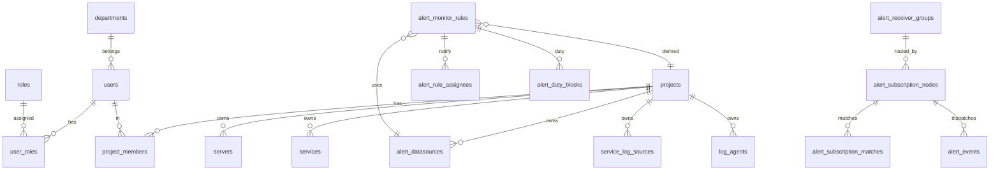

# 数据库设计：表与关系

ORM：**GORM**；迁移：`internal/bootstrap/migrate_schema.go` 中 `AutoMigrateModels` 与 `go run . migrate` 一致。

## 1. ER 关系（逻辑）

## 2. 核心表分组

### 2.1 身份与权限

| 表 | 说明 |
|----|------|
| `users` | 用户，软删 |
| `roles` | 角色编码，如 `super-admin` |
| `user_roles` | 多对多 |
| `permissions` | API 资源路径 + HTTP 方法（与 Casbin 同步） |
| `casbin_rule` | Casbin 适配器表（策略存储） |
| `menus` | 菜单树，关联前端组件名 |
| `departments` | 部门树 |
| `registration_requests` | 注册申请 |

### 2.2 项目与资源

| 表 | 说明 |
|----|------|
| `projects` | 项目租户 |
| `project_members` | `(project_id,user_id)` 唯一，项目内角色 |
| `server_groups` | 服务器分组树 |
| `servers` / `server_credentials` / `cloud_accounts` | 主机与凭据 |
| `services` | 项目服务 |
| `service_log_sources` | 日志源 |
| `log_agents` / `agent_discovery` | Agent 与发现 |

### 2.3 告警

| 表 | 说明 |
|----|------|
| `alert_channels` | 通知通道 |
| `alert_subscription_nodes` | 订阅树节点（匹配与路由） |
| `alert_receiver_groups` | 接收组（绑定通道与接收人） |
| `alert_subscription_matches` | 订阅命中审计记录 |
| `alert_datasources` | Prometheus 等（绑定 `project_id`） |
| `alert_silences` | 静默规则 |
| `alert_monitor_rules` | 监控规则（`project_id` 从数据源推导） |
| `alert_rule_assignees` | 处理人 JSON |
| `alert_duty_blocks` | 值班班次 |
| `alert_events` | 历史事件 |

### 2.4 K8s 与其它

| 表 | 说明 |
|----|------|
| `k8s_clusters` | 集群连接信息 |
| `dict_entries` | 数据字典 |
| `login_logs` / `operation_logs` | 审计 |

## 3. 软删除

广泛使用 GORM `DeletedAt`；业务查询需注意 `Unscoped` 场景（如物理清理由运维执行）。

## 4. 索引建议（运维）

- 大表按时间与 `user_id`/`project_id` 监控慢查询后加索引。
- `dict_entries` 历史迁移已处理重复与索引问题，见 `migrate_schema.go`。
